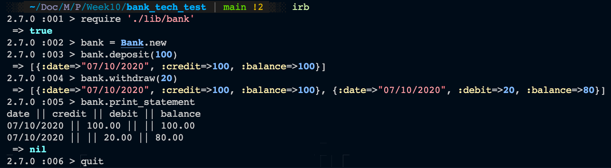

## Specification

### Requirements

* You should be able to interact with your code via a REPL like IRB or the JavaScript console.  (You don't need to implement a command line interface that takes input from STDIN.)
* Deposits, withdrawal.
* Account statement (date, amount, balance) printing.
* Data can be kept in memory (it doesn't need to be stored to a database or anything).

### Acceptance criteria

**Given** a client makes a deposit of 1000 on 10-01-2012  
**And** a deposit of 2000 on 13-01-2012  
**And** a withdrawal of 500 on 14-01-2012  
**When** she prints her bank statement  
**Then** she would see

```
date || credit || debit || balance
14/01/2012 || || 500.00 || 2500.00
13/01/2012 || 2000.00 || || 3000.00
10/01/2012 || 1000.00 || || 1000.00
```

### User stories

As a customer,
So that I can keep my money safe,
I want to open a bank account

As a customer,
So that I can put my money in a safe place.
I want to be able to deposit money into my bank account

As a customer,
So that I can use my money when I need to,
I want to be able to withdraw money from my bank account

As a customer,
So that I can keep track of my incomings and outgoings,
I want to be able to print a bank statement 

### Screenshot of app



### How to run on your own system

1. Fork/Clone this repo.
2. Run 'bundle install' in your terminal.
3. Run 'irb' in your terminal.
4. Enter "require './lib/bank'" in your terminal.
5. Enter 'bank = Bank.new' in your terminal to open a new bank account. Replace the first bank with any word of your choosing to change the name.
6. Interact with the program in your terminal with the following commands 'bank.deposit(amount)', 'bank.withdraw(amount)', and 'bank.print_statement'.

### How to run tests

1. Fork/Clone this repo.
2. Run 'bundle install' in your terminal.
3. Run 'rspec' in terminal.

### Code Quality

[](https://bettercodehub.com/)
